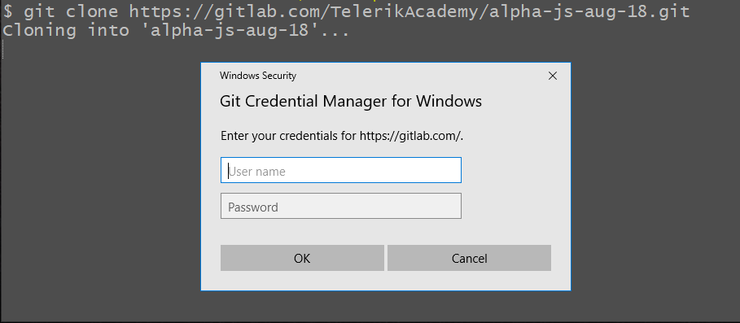

# Git - Tasks

### 1. Create an account in [https://gitlab.com](https://gitlab.com)

   - If you already have one it is okay to use it
   - If you have account in GitLab and you want to use it - it is **mandatory to change your password**

### 2. Clone the Alpha repository

   - Open [https://gitlab.com/TelerikAcademy/alpha-32-js](https://gitlab.com/TelerikAcademy/alpha-32-js)

     

   - Copy the **HTTPS url**
   - Open the folder on your computer, where you will store your repositories
   - Right click and select **Git Bash Here** option
   - Execute the following command (it will clone the repository to your computer)

     ```bash
     git clone https://gitlab.com/TelerikAcademy/alpha-32-js
     ```

   - Windows: It will prompt you for credentials from gitlab.com (it is a one time only)

     

      - If you misspell your credentials you need to go to *Control Panel -> User Accounts -> Credential Manager.* Click on **Windows Credentials**. Down in the **Generic Credentials** window click on *git -> edit* - now enter the correct credentials.

### 3. Practice

1. Create a new repository

    

    - Name it A23-{Your-Name}, for example A23-Nadia-Hristova
    - It is **mandatory** to be private
    - You are **not allowed** to commit any of the exam tasks there

    


2. Make local changes
   
     - Clone your newly created repository like the one which we showed earlier
     - Make a change to the README.md file
     - Open the folder and right click and use **Git Bash Here** option again
     - Type **git status** - this will show you all the files that have been changed/modified/deleted
     - Or use any GUI (Graphical User Interface) such as VSCode
     - Now you have to sync your local changes with gitlab.com. How can you do that?
     
3. Make changes in gitlab (it is like someone pushed new changes there)
   - Open [https://gitlab.com](https://gitlab.com)
   
   - Navigate to your repository
   
   - Open the README.md file
   
   - Now with the **Edit** button you can make changes
   
     
   
   - Commit the changes
   
   - Now you have to sync the changes to your local repository. How you can do that?
   
4. Add your work so far

   - Go to your projects
   - Copy them in cloned repo. Use some nice organization, for example JS Core / Functions / Tasks
   - Commit newly added files
   - Update the remote

**HINTS**

Use any GUI by your choice - **preferably VSCode** or you could use the commands below and figure out how to use them

```bash
git pull
git add .
git push
git commit -m "Some message"
```
